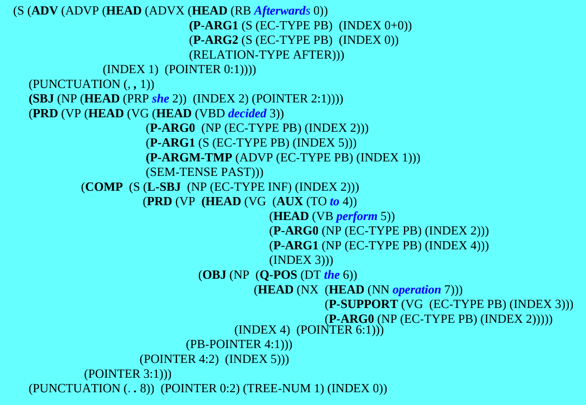

# HMM POS Tagging

## POS Tagger Tool


POS Tagger Tool


## HMM Viterbi Algorithm

### Training States

**Transition Probability / Prior Probability**

$$Trans\_Prob(TagA \rightarrow TagB) = {{Count(TagB\_following\_TagA)}\over{Count(TagA)}}$$

**Emission Probability / Likelihood** $$Emis\_Prob(TokenA, TagA) = {{Count(TokenA\_being\_TagA)}\over{Count(TagA)}}$$

### Viterbi Algorithm

Each step:

$$Step\_Prob(TokenA, TagA) = max[Step\_Prob(Last\_Token, TagX) * Trans\_Prob(TagX, TagA)] * Emis\_Prob(TokenA, TagA)$$

