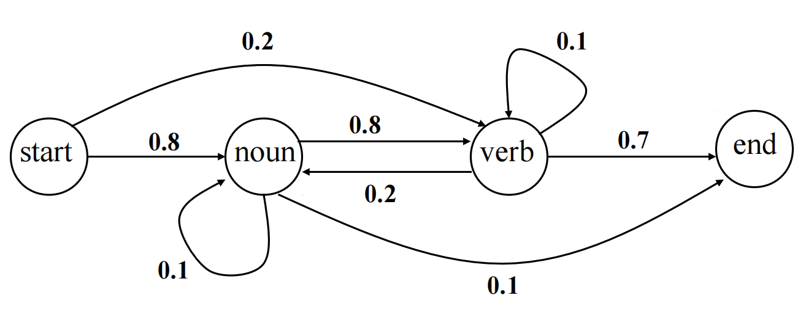
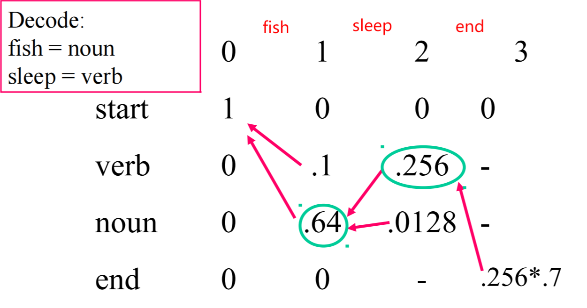

# HMM POS Tagging

## POS Tagger Tool

 POS Tagger Tool


## Penn Treebank POS Tag Set

| Tag      | Description                             | Examples       | Tag     | Description                        | Examples         |
| -------- | --------------------------------------- | -------------- | ------- | ---------------------------------- | ---------------- |
| **CC**   | Coordinating conjunction 并列连词       | and, or        | **RB**  | Adverb 副词                        | very             |
| **CD**   | Cardinal number 数                      | one, 2         | **RBR** | Adverb, comparative 副词比较级     | better           |
| **DT**   | Determiner 限定词                       | the, a         | **RBS** | Adverb, superlative 副词最高级     | best             |
| **FW**   | Foreign word 外来词                     | 单词           | **SYM** | Symbol 符号                        | %                |
| **IN**   | Preposition or subord. 介词或从属连词   | of, in, with   | **TO**  | Infinitival marker 不定式标记      | to               |
| **JJ**   | Adjective 形容词                        | big, nice      | **UH**  | Interjection 感叹词                | um, ah, oh, oops |
| **JJR**  | Adjective, comparative 形容词比较级     | bigger, better | **VB**  | Verb, base form 动词原形           | go               |
| **JJS**  | Adjective, superlative 形容词最高级     | biggest, best  | **VBD** | Verb, past form 动词过去式 ed      | went             |
| **LS**   | List item marker 列表头标               | 1, 2, 3        | **VBG** | Verb, gerund form 动词现在分词 ing | running          |
| **MD**   | Modal 情景动词                          | can, should    | **VBN** | Verb, past part 动词过去分词       | ran              |
| **NN**   | Noun, singular or mass 名词单数或不可数 | book, car      | **VBP** | Verb, present 动词现在时           | eat              |
| **NNS**  | Noun, plural 名次复数                   | books, cars    | **VBZ** | Verb, 3rd person 动词三单          | eats             |
| **NNP**  | Proper noun, singular 专有名词单数      | Edinburgh      | **WDT** | Wh-determiner Wh-限定词            | which            |
| **NNPS** | Proper noun, plural 专有名次复数        | Smiths         | **WP**  | Wh-pronoun Wh-代词                 | who              |
| **PDT**  | Predeterminer 前置限定词                | all, both      | **WP**$ | Possessive wh-pron. Wh-物主代词    | whose            |
| **POS**  | Possessive ending 所有格后缀            | 's             | **WRB** | Wh-adverb Wh-副词                  | how              |
| **PRP**  | Personal pronoun 人称代词               | I, you, he     | **PU**  | Punctuation 标点                   | ",", "."         |
| **PRP**$ | Possessive pronoun 物主代词             | my, your, his  |

## HMM Viterbi Algorithm

### Training States

**Transition Probability / Prior Probability**

$$Trans\_Prob(TagA \rightarrow TagB) = {{Count(TagB\_following\_TagA)}\over{Count(TagA)}}$$

**Emission Probability / Likelihood**
$$Emis\_Prob(TokenA, TagA) = {{Count(TokenA\_being\_TagA)}\over{Count(TagA)}}$$

### Viterbi Algorithm

Each step:

$$Step\_Prob(TokenA, TagA) = max[Step\_Prob(Last\_Token, TagX) * Trans\_Prob(TagX, TagA)] * Emis\_Prob(TokenA, TagA)$$

### Example: Fish sleep.

#### Transition Probability

#### Emission Probability

$$Emis\_Prob(fish, noun)={8\over{8+2}}=0.8$$
$$Emis\_Prob(fish, verb)={5\over{5+5}}=0.5$$
$$Emis\_Prob(sleep, noun)={2\over{8+2}}=0.2$$
$$Emis\_Prob(sleep, verb)={5\over{5+5}}=0.5$$

#### Steps

