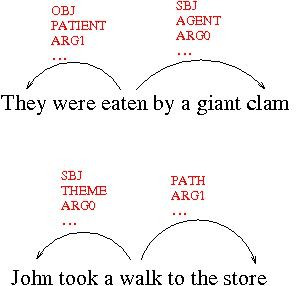
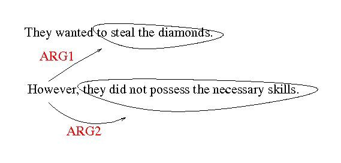
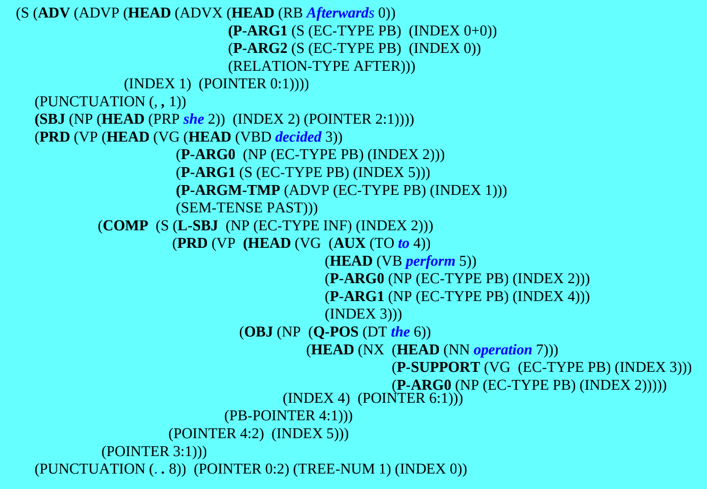

# Introduction

## Computational Linguistics

AKA, Natural Language Processing (NLP), Language Engineering, ...

**Domain:** The set of problems involving the interpretation and generation of
human language text and speech

**Poperties:**

- As with applied science: the proof is in the pudding
- Sometimes at odds with theoretical linguistics
  - Need not model human abilities and human methods
  - Need not correspond to published linguistic theories
  - Sometimes draws on linguistic theories and/or studies of human processing
- Broad and changing domain influenced by available funding

### Computational Linguistics Applications

- **Machine translation:** Methods are not at all based on how humans translate;
  Effective for gisting text, generating 1st draft translations, but not for
  high-level translation; Works better for “controlled languages” – technical
  manuals (Microsoft, Catterpiller, etc.);
  [Systran](https://translate.systran.net/?lang=en);
  [Google](http://www.google.com/language_tools?hl=en);
- **Spoken Language:** dictation (IBM ViaVoice, Dragon Naturally Speaking),
  Telephone-based customer support (phone mazes)
- **Information Retrieval:** Finding documents based on a query, e.g., Web
  Searches
- **Information Extraction:** Dealtime, Google Products, Monster.com (job
  search); Some open source tools: [OpenNLP](https://opennlp.apache.org),
  [AliasI](http://alias-i.com/lingpipe/); Tools on NYU website include:
  [NYU NLP Products](http://nlp.cs.nyu.edu/projects/index.shtml#t-r-i),
  [NYU Grishman Jet](http://cs.nyu.edu/grishman/jet/jet.html),
  [NYU NLP ICE](http://nlp.cs.nyu.edu/ice/),
  [NYU NLP Termolator](http://nlp.cs.nyu.edu/termolator/).
- **Question Answering:** ask.com, Wolfram Alpha, MIT start:
  http://start.csail.mit.edu/
- **Summarization:** http://textsummarization.net/text-summarizer
- **Spelling/Grammar Checking**, etc. https://languagetool.org/
- Other NLP demos:
  https://towardsdatascience.com/the-best-nlp-tools-of-early-2020-live-demos-b6f507b17b0a

## Lowest Level Syntactic Processing (text)

- **Tokenization and Segmentation:** Given a sentence, determine the words or
  word-like units that it consists of. NLTK command:
  `nltk.word_tokenize('this is a sentence')`
- **Part of Speech Tagging** (modified PTB): Apply a set of part of speech tags
  to a set of tokens. NLTK command: `nltk.pos_tag(tokens)`
- **Named Entity Tagging** (with a little semantics): Mark boundaries of names
  of type `PERSON`, `ORGANIZATION`, `FACILITY`, `GPE`, `LOCATION`, … NLTK
  command: `nltk.chunk.ne_chunk(nltk.pos_tag(nltk.word_tokenize(test_sentence)`
- Chunking: mark verb groups and/or noun groups, convenient approximations of
  syntactic units. NLTK see following lines of code.

```python
sentence = 'The book with the blue cover will end up on the shelf.'
chunks = r"""
NG: {(<DT|JJ|NN>)*(<NN|NNS>)}
VG: {<MD|VB|VBD|VBN|VBZ|VBP|VBG>*<VB|VBD|VBN|VBZ|VBP|VBG><RP>?}
"""
chunks_grammar = nltk.RegexpParser(chunks)
chunks_grammar.parse(nltk.pos_tag(nltk.word_tokenize(sentence)))
```

## Parsing: High Level Syntactic Processing

```
(S (NP (DT the) (NN book)
       (PP (IN with)
           (NP (DT the)
               (JJ blue)
               (NN cover))))
   (VP (VBZ is)
       (PP (IN on)
           (NP (DT the) (NN shelf)))))
```

## Semantics

A wide range of topics loosely referring to "meaning".

Some Example Topics which may be part of Semantics:

- Word Sense Disambiguation
- Predicate Argument Structure
- Anaphora
- Discourse Argument Structure
- "Semantic Parsing"

### Word Sense Disambiguation

For interesting characterizations of word senses (and relation between senses),
use WordNet (online or download it): wordnet.princeton.edu.

Difficult sense disambiguation: Example: senses 2, 6 and 9 for word "bank" are
arguably not distinct. Lexicographers are acutely aware of the merging vs.
splitting problem of enumerating senses. CL systems usually collapse some
WordNet distinctions.

### Predicate / Argument Structure

For thousands of years, linguists have employed systems to characterize
predictable paraphrases, e.g., Pāṇini, a Sanskrit linguist from the 4rth Century
BC

In 21st Century CL, semantic role labeling is popular



### Anaphora

Coreference

- Though **Big Blue** won the contract, this official is suspicious of **IBM**.
- **Mary** could not believe what **she** heard.

Other Varieties

- John ate **a sandwich** and Mary ate **one** also. \[type coref]
- **The amusement park** is very dangerous. **The gate** has sharp edges. **The
  rides** have not been inspected for years. \[Bridging Anaphora]
- **This book** is valuable, but **the other book** is not. \[Other coref]

### Discourse Argument Structure

Adverbs, Subordinate/Coordinate, Conjunctions, among other words link clauses



### Semantic Parsing (e.g. GLARF)

Means different things to different researchers, but my version of semantic
parsing is called [GLARF](http://nlp.cs.nyu.edu/meyers/GLARF.html).

One representation of the sentence that includes as much information as
possible: lexical categories, predicate argument structure, discourse
annotation, etc.

#### Example

A representation of the sentence:

- `Afterwards, she decided to perform the operation.`&#x20;
- When it occurs after the sentence: `The doctor ran some tests`



## Role of Manual Annotation

Used to create, test and fine-tune task definitions/guidelines.

- For a task to be well-defined, several annotators must agree on classification
  most of the time.
- If humans cannot agree, it is unlikely that a computer can do the task at all
- Popular, but imperfect measurement of agreement:

$$
Kappa={{Percent(Actual\_Agreement) - Prob(Chance\_Agreement)}\over{1 - Prob(Chance\_Agreement)}}
$$

Used to create answer keys to score system output.

- One set of measures are: recall, precision and f-score:

&#x20; $$Recall={{\lvert Correct \rvert}\over{\lvert Answer\_Key \rvert}}$$
$$Precision={{\lvert Correct \rvert}\over{\lvert System\_Output \rvert}}$$

$$
F\_Score={1\over{{1\over2}*({1\over{Precision}}+{1\over{Recall}})}}
$$

### Manual Annotation in Supervised Statistical ML

Divide the corpus into sub-corpora

- A training corpus is used to acquire statistical patterns
- A test corpus is used to measure system performance
- A development corpus is similar to a test corpus
  - Systems are “tuned” to get better results on the dev corpus
  - Test corpora are only used infrequently to insure accuracy/fairness: The
    system should not be tuned to get better results
- More annotated text often yield better results
- Different genres may have different properties
  - Systems can “train” separately on different genres
  - Systems can “train” on one diverse corpus
