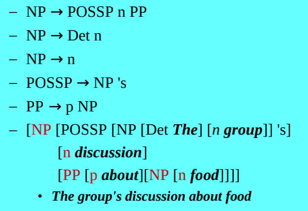

# Regular Expressions

## Formal Language = Set of Strings of Symbols

A Formal Language can model a phenomenon, e.g. written English

Examples: All combinations of the letters, any number of As, followed by any
number of Bs, mathematical equations, all the sentences of a simplified version
of written English, a sequence of musical notation (e.g., the notes in
Beethoven's 9th Symphony), etc.

### What is a Formal Grammar for?

A formal grammar: a set of rules that match all and only instances of a formal
language. A formal grammar defines a formal language.

In Computer Science, Formal grammars are used to **generate** and **recognize**
formal languages (e.g., programming languages)

- Parsing a string of a language involves:
  - Recognizing the string and
  - Recording the analysis showing it is part of the language
- A compiler translates from language X to language Y, e.g.,This may include
  parsing language X and generating language Y
- If all natural languages were formal languages, then Machine Translation
  systems would just be compilers

### A Formal Grammar Consists of

#### N: a Finite set of non-terminal symbols

Symbols that can be replaced by other symbols

#### T: a Finite set of terminal symbols

Symbols that cannot be replaced by other symbols

#### R: a set of rewrite rules

Replace the symbol sequence XYZ with abXzY: `XYZ → abXzY`

#### S: A special non-terminal that is the start symbol

Marks the start of the language

## The Chomsky Hierarchy

Type0 ⊇ Type1 ⊇ Type2 ⊇ Type3

### Type 0: No restrictions on rules

Equivalent to Turing Machine, general system capable of simulating any
algorithm.

### Type 1: Context-sensitive rules

`αAβ → αγβ`

- Greek letters = 0 or more non-terms/terms.
- A = non-terminal
- Rule means: replace A with γ, when A is between α and β

### Type 2: Context-free rules

`A → αγβ`

- Like context-sensitive, except left-hand side can only contain exactly one
  non-terminal

Example Rule from linguistics:


### Type 3: Context-free rules with restrictions

Regular (finite state) grammars

- `A → βa` or `A → ϵ` (left regular)
- `A → aβ`, or `A → ϵ` (right regular)

Like Type 2, except:

- Non-terminals can precede terminals in left regular grammar
- Non-terminals can follow terminals in right regular grammar
- Null string is allowed

Type-3 grammars generate the regular languages

#### Further Simplifications

Type-3 grammars must have a single non-terminal on the left-hand side and a
right-hand side consisting of a single terminal or single terminal followed by a
single non-terminal.

The productions must be in the form `X → a` or `X → aY`

where X, Y ∈ N (Non terminal)

and a ∈ T (Terminal)

The rule S → ε is allowed if S does not appear on the right side of any rule.

### Comparisons

Type 3 grammars: Least expressive, Most efficient processors

Type 0 grammars: Most expressive, Least efficient processors

Complexity of recognizer for languages:

- Type 0: exponential
- Type 1: polynomial
- Type 2: $$O(n^3)$$
- Type 3: $$O(n logn)$$

### CL mainly features Type 2 & 3 Grammars

Type 3 grammars:

- Include regular expressions and finite state automata (aka, finite state
  machines)
- The focal point of the rest of this talk
- Also see [Nooj platform for NLP](http://www.nooj-association.org/)

Type 2 grammars:

- Commonly used for natural language parsers
- Used to model syntactic structure in many linguistics theories (often
  supplemented by other mechanisms)
- Important for later talks on constituent structure & parsing

### Type 1.5 Grammars

Human Language believed to be “mildly context sensitive”

- Less expressive than type 1 (context sensitive)
- More expressive than type 2 (context-free)

Some complex dependencies cannot be expressed in context free rules, e.g. see
[this](https://dash.harvard.edu/bitstream/handle/1/2026618/Shieber_EvidenceAgainst.pdf?sequence=2)

Three Adjoining Grammars

- https://repository.upenn.edu/cgi/viewcontent.cgi?article=1706&context=cis_reports
- https://www.aclweb.org/anthology/H86-1020.pdf
- Formalism by A. Joshi & others
- May be able to handle these cases

## Regular Expressions

Concatenation

- If X is a regexp and Y is a regexp, then XY is a regexp
- Examples:
  - If `ABC` and `DEF` are regexps, then `ABCDEF` is a regexp
  - If `AB*` and `BC*` are regexps, then `AB*BC*` is a regexp Note: Kleene \_ is
    explained below

Disjunction

- If X is a regexp and Y is a regexp, then `X | Y` is a regexp
- Example: `ABC|DEF` will match either `ABC` or `DEF`

Repetition

- If X is a regexp then a repetition of X will also be a regexp
  - The Kleene Star: `A*` means 0 or more instances of A
  - Regexp{number}: `A{2}` means exactly 2 instances of A

Disjunction of characters

- `[ABC]` – means the same thing as `A | B | C`
- `[a-zA-Z0-9]` – character ranges are equivalent to lists:
  `a|b|c|...|A|B|...|0|1|...|9`

Negation of character lists/sequences

- `^` inside bracket means complement of disjunction, e.g., `[^a-z]` means a
  character that is neither a nor b nor c … nor z

Parentheses

- Disambiguate scope of operators
  - `A(BC)|(DEF)` means `ABC` or `ADEF`
  - Otherwise defaults apply, e.g., `ABC|D` means `ABC` or `ABD`

`?` signifies optionality

- `ABC?` is equivalent to `(ABC)|(AB)`

`*` indiates 1 or more

- `A(BC)*` is equivalent to `A|(A(BC)+)`

Special Symbols:

- Period means any character, e.g., `A.*B` – matches A and B and any characters
  between
- Carrot (`^`) means the beginning of a line, e.g., ^ABC matches ABC at the
  beginning of a line [*Note dual usage of ^ as negation operator]
- Dollar sign (`$`) means the end of a line, .e.g., `[\.?!] *$` matches final
  punctuation, zero or more spaces and the end of a line

Sets of characters:

- `\w` = `[A-Za-z0-9_]`
- `\W` = `[^A-Za-z0-9_]`

## Finite State Automata

Devices for recognizing finite state grammars (include regexps)

Two types

- Deterministic Finite State Automata (DFSA): Rules are unambiguous
- NonDeterministic FSA (NDFSA): Rules are ambiguous. Sometimes more than one
  sequence of rules must be attempted to determine if a string matches the
  grammar. Ways to solve this: Backtracking, Parallel Processing and Look Ahead.

Any NDFSA can be mapped into an equivalent (but larger) DFSA

### DFSA


Algorithm:

```pseudocode
D-Recognize(tape, machine)
    pointer ← beginning of tape
    current state ← initial state Q0
    repeat until the end of the input is reached
        look up (current state,input symbol) in transition table
        if found: set current state as per table look up
                  advance pointer to next position on tape
        else: reject string and exit function
    if current state is a final state: accept the string
    else: reject the string
```

### NDFSA


Algorithm:

```pseudocode
ND-Recognize(tape, machine)
    agenda ← {(initial state, start of tape)}
    current state ← next(agenda)
    repeat until accept(current state) or agenda is empty
        agenda ← Union(agenda,look_up_in_table(current state,next_symbol))
        current state ← next(agenda)
    if accept(current state): return(True)
    else: false
```

Accept if at the end of the tape and current state is a final state

Next defined differently for different types of search

- Choose most recently added state first (depth first)
- Chose least recently added state first (breadth first)
- Etc.
